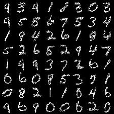

## LayoutGAN in Tensorflow

Official Tensorflow implementation of "LayoutGAN: Generating Graphic Layouts with Wireframe Discriminators" publishsed in ICLR 2019: 
https://openreview.net/forum?id=HJxB5sRcFQ. 

Some codes are implemented from https://github.com/carpedm20/DCGAN-tensorflow. 

This project is licensed under the terms of the “Creative Commons Attribution-NonCommercial-ShareAlike 4.0 International” license.

## Online Demo
Animation videos to demonstrate the movements of all the graphic elements. 
- MNIST 
 

- Tangram 

## Prerequisites

- Python 2.7
- Tensorflow 1.2.0

## Usage

First, download the trasformed point layout representation of MNIST dataset from  \
https://drive.google.com/file/d/1R1iRZxADR_RcDsuR4gyStyLAo7i5LRAH/view?usp=sharing, \
and put it under ./data directory.

To train a model with downloaded dataset: \
$ bash ./experiments/scripts/train_mnist.sh

For bounding box layout experiments, you may refer to the commented lines in the code.

## Results on MNIST

